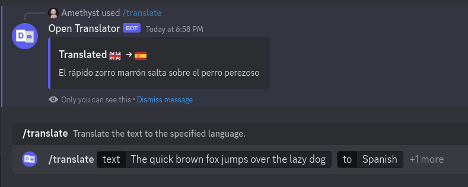
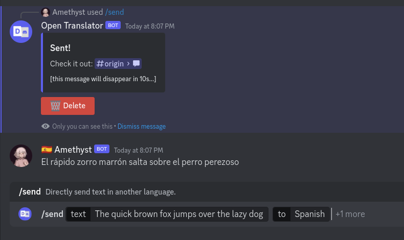
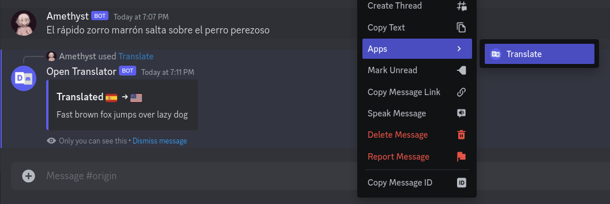
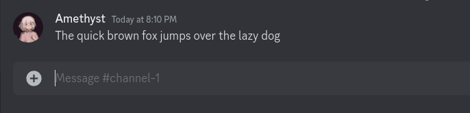
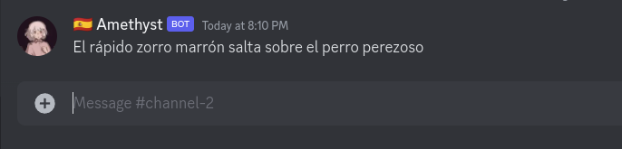
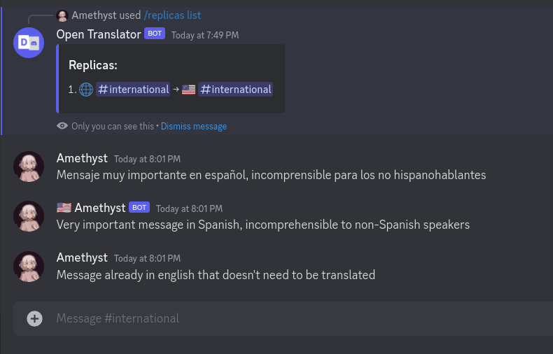
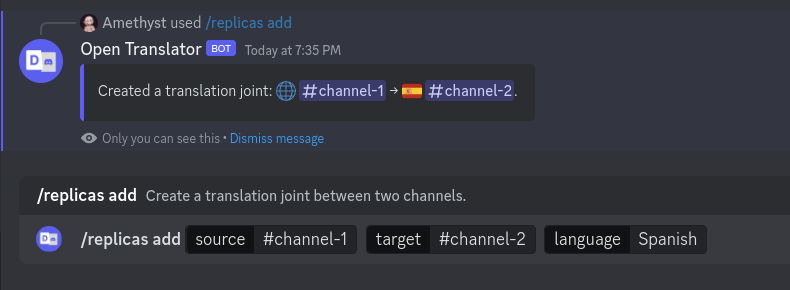
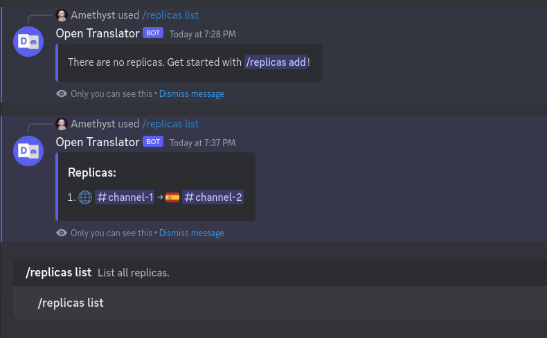
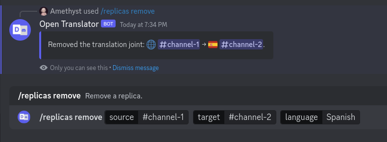

# open discord translator
An open source discord bot using the latest discord integration features and supporting multiple translation backend

NOTE: this bot has been designed for a very limited amount of guild because of the translation APIs quota limitations,
as such, it is not recommended to use it on a large scale.
## Features
### Translation Command
Translate a message to another language using the `/translate` command without leaving discord


### Directly send the translated message
Write a message in a language for it to be sent in another language using the `/send` command

**note:** because the bot is using webhooks normal users cannot delete their message,
as such, a delete button is provided to the user if the translation doesn't seem right.

### Context menu translation
To quickly translate a message to your language, just right click on it then do `apps > translate`

It'll automatically detect the input language and translate it to the language set in your discord settings

### Replicas
Replicas are translation joints between two channels.

For example, a message in #channel-1...


...will be translated to spanish and be sent to #channel-2


or a #international channel can automatically provide a copy of the message in english

_in this scenario, messages that are already into the target language won't get translated_

#### Managing replicas
Replicas are managed using the `/replicas` command

Use `/replicas add` to add a new replica


Use `/replicas list` to list all the replicas


Use `/replicas remove` to remove a replica


⚠ because replicas require the privileged intent `READ_MESSAGE_CONTENT` to work, they are disabled by default. (see the [Environment variables](#environment-variables) section for guidance)

## Installation
⚠️ To setup the bot, you'll need a discord bot token. If you don't know how to create one, you can find a quick tutorial [here](https://discordjs.guide/preparations/setting-up-a-bot-application.html#creating-your-bot).
### Using Docker (recommended)
#### Docker compose (recommended)
Edit the [docker-compose.yml](./docker-compose.yml) file present in this repo and set the environment variables (check the [Environment variables](#environment-variables) section for more information)

then start the bot (tip: you can use the `-d` flag to run it in the background)
```bash
docker-compose up
```
to invite the bot, use the link printed in the console
(use `docker-compose logs` to get the link if you started the bot in the background)

#### Docker cli
```bash
docker volume create open-discord-translator
docker run -d \
    --name open-discord-translator \
    -e TOKEN=[your token here] \
    -e GUILD= \
    -e SKIP_COMMAND_VALIDATION=false \
    -e ACCENT_COLOR=Blurple \
    -e DELETE_BUTTON_TIMEOUT=10 \
    -e ENABLE_REPLICAS=false \
    -e TRANSLATION_API_DRIVER=google_search \
    -e SELECTED_LANGUAGES=en,es,fr,de,it,ja,ko,pt,ru,zh-CN,zh-TW,pl,nl,sv,ar,cs,da,fi,el,hi,hu,id,no,la,ro \
    -e GOOGLE_API_KEY= \
    -e DEEPL_API_KEY= \
    -e LIBRETRANSLATE_URL= \
    -e DATABASE_PATH=database.sqlite \
    -e DATABASE_DRIVER=sqlite \
    -v open-discord-translator:/app/database.sqlite \
    ghcr.io/kalitsune/open-discord-translator:latest
```
to invite the bot, use the link printed in the console

#### Using kubernetes (experienced users only)
⚠ the bot has not been designed to be scaled up, as such, if you set more than one replica, the bot may behave unexpectedly.

[Direct deploy](https://github.com/Kalitsune/open-discord-translator/blob/main/open-discord-translator.yml) (you'll still need to setup some environment variables for it to work)
```bash
kubectl apply -f https://raw.githubusercontent.com/Kalitsune/open-discord-translator/main/open-discord-translator.yml
kubectl edit deployment.apps odt-deployment
```

Using the [kubernetes deployment file](open-discord-translator.yml) provided in this repository
```bash
kubectl apply -f open-discord-translator.yml
```

### Using nodejs
grab the latest release on [github](https://github.com/Kalitsune/open-discord-translator/releases/latest) then uzip it

install the dependencies
```bash
npm install --production
```

edit the .env file to your needs, be sure to set the `DISCORD_TOKEN` variable
check the [Environment variables](#environment-variables) section for more information

then start the bot
```bash
npm start
```
to invite the bot, use the link printed in the console

### Environment variables
| Variable                  | Description                                                                                                                                                                            | Default value       |
|---------------------------|----------------------------------------------------------------------------------------------------------------------------------------------------------------------------------------|---------------------|
| `TOKEN`                   | The discord bot token                                                                                                                                                                  | `none`              |
| `GUILD`                   | IF defined, the bot will be restricted to this specific guild id                                                                                                                       | `none`              |
| `SKIP_COMMAND_VALIDATION` | If set to true, the bot will not check if the commands are up to date                                                                                                                  | `false`             |
| `ACCENT_COLOR`            | Color used for the bot embeds can be a number, hex or [one of those](https://old.discordjs.dev/#/docs/discord.js/14.11.0/typedef/ColorResolvable)                                      | `Blurple`           |
| `DELETE_BUTTON_TIMEOUT`   | The time in seconds before the delete button for the `send` disappear (leave empty for infinite)                                                                                       | `10`                | 
| `ENABLE_REPLICAS`         | Enable the `/replicas` commands as well as listening to potential message to translate. ⚠ Require `MESSAGE_CONTENT` privileged intent                                                  | `false`             |
| `TRANSLATION_API_DRIVER`  | The translation API to use ([check supported drivers](#translation-api-drivers))                                                                                                       | `google`            |
| `SELECTED_LANGUAGES`      | The languages to use for the translation command, if empty, the first 25 supported languages returned by the translation driver will be used                                           | `[CSV, check .env]` |
| `GOOGLE_API_KEY`          | Your [google api key](https://ezgielouzeh.medium.com/google-translate-api-javascript-81f55039611d), only needed if you use the [google paid translation API](#translation-api-drivers) | `none`              |
| `DEEPL_API_KEY`           | Your deepl auth key, only needed if you use the [deepl translation API](#translation-api-drivers)                                                                                      | `none`              |
| `LIBRETRANSLATE_URL`      | The link to where your libretranslate is running, only needed if you use [libretranslate](#setting-up-libretranslate)                                                                  | `none`              |
| `DATABASE_DRIVER`         | The database driver to use ([check supported drivers](#database-api-drivers))                                                                                                          | `sqlite`            |
| `SQLITE_PATH`             | The path to the sqlite database file, only needed if you use the [sqlite database driver](#database-api-drivers)                                                                       | `./database.sqlite` |

### Translation API drivers
| Driver name      | Description                                                                           |
|------------------|---------------------------------------------------------------------------------------|
| `google_search`  | The google translation API for free, the threshold might be low                       |
| `google_cloud`   | The google translation API, you need to set the `GOOGLE_API_KEY` environment variable |
| `deepl`          | The deepl translation API, you need to set the `DEEPL_API_KEY` environment variable   |
| `libretranslate` | The libretranslate API, you need to set the `LIBRETRANSLATE_URL` environment variable |
### Database API drivers
| Driver name | Description                                                                                                                      |
|-------------|----------------------------------------------------------------------------------------------------------------------------------|
| `sqlite`    | The sqlite database driver, you need to set the `SQLITE_PATH` environment variable to enable persistence but it is not mandatory |

## Development 

### Localizations
As of today, the bot is only localized in the following languages:
<br/>
If you want to join the translation effort in order to make open-discord-translator available to a broader audience of people [you're welcome to help](https://crowdin.com/project/open-discord-translator/invite?h=1bff0f20415b6c77c234e5c0acd677771811165)!

### Setup
⚠️ To setup the bot, you'll need a discord bot token. If you don't know how to create one, you can find a quick tutorial [here](https://discordjs.guide/preparations/setting-up-a-bot-application.html#creating-your-bot).

clone the repository and install the dependencies
```bash
git clone https://github.com/Kalitsune/open-discord-translator
cd open-discord-translator
npm install
```

cr
eate a .env.dev file and set the `DISCORD_TOKEN` variable (check the [Environment variables](#environment-variables) section for more information)
```bash
cp .env .env.dev
```

then start the bot
```bash
npm run dev
```
to invite the bot, use the link printed in the console

#### Setting Up LibreTranslate
To utilize [LibreTranslate](https://github.com/LibreTranslate/LibreTranslate), you must first set it up, which is a straightforward process. Begin by cloning the repository with the following command:
```bash
git clone git@github.com:LibreTranslate/LibreTranslate.git
```
Ensure docker is operational on your system, then initiate LibreTranslate using:
```bash
./run.sh --port 6969 # Use http://localhost:6969 as your LIBRETRANSLATE_URL
# For Windows, use: run.bat --port 6969
```

Additionally, various methods for launching LibreTranslate are detailed here: [click](https://github.com/LibreTranslate/LibreTranslate#install-and-run), providing instructions for docker, CUDA hardware acceleration, [k8s](https://github.com/LibreTranslate/LibreTranslate#run-with-kubernetes), and building from source.

A comprehensive list of all [settings and flags](https://github.com/LibreTranslate/LibreTranslate#settings--flags) is also available, offering options to modify the IP address and port for LibreTranslate, along with many other configurations.

### Discord api
the bot is initialized in the `./src/index.js` file,
everything in the `./src/discord/` directory is related to the discord api
the `./discord/events/` discord directory contains the discord events listeners, the file name must be [one of those](https://old.discordjs.dev/#/docs/discord.js/main/typedef/Events)
the `./discord/interactions/commands/` discord directory contains the discord commands, the file name does not matter

### Add a new translation API driver
create a new file in the `./src/api/drivers/` directory
```bash
touch ./src/translations/drivers/mydriver.js
```

make sure to export the following functions
```js
module.exports = {
    async init() {
        // if you need to initialize the driver, do it here
        // you must return the supported source and target languages 
        // warning: the supported languages can't be more than 25 due to discord limitations
        const supported_languages = [
            {
                "language": "Afrikaans",
                "code": "af"
            },
            // ...
        ];
        return supported_languages
    },
    async translate(text, to, from= undefined) {
        // translate the text from the source language to the target language
        // return the translated text
        // feel free to add more environment variables if needed (don't forget to update the readme)
        
        // you must return the translated text and the source language, if it is auto, then return the detected language
        return {text: translated_text, from: source_language}
    }
}
```

then you set the `TRANSLATION_API_DRIVER` environment variable to your driver name and start the bot

### Add a new database driver
create a new file in the `./src/database/drivers/` directory
```bash
touch ./src/database/drivers/mydriver.js
```

make sure to export the following functions
```js
module.exports = {
    async init() {
        // if you need to initialize the driver, do it here
        // feel free to add more environment variables if needed (don't forget to update the readme)
    },
    async addReplicaChannels(guildId, sourceChannelId, targetChannelId, targetLanguageCode) {
        // add a channel to be replicated in another language
    },
    async getReplicaChannels() {
        // get all the channels to be replicated
    },
    async getGuildReplicaChannels(guildId) {
        // get all the channels to be replicated in a guild
    },
    async getReplicaChannel(sourceChannelId, targetChannelId, targetLanguageCode) {
        // get a specific channel to be replicated
    },
        async removeReplicaChannel(sourceChannelId, targetChannelId, targetLanguageCode) {
        // remove a channel from the replication list
    },
}
```

then you set the `DATABASE_DRIVER` environment variable to your driver name and start the bot